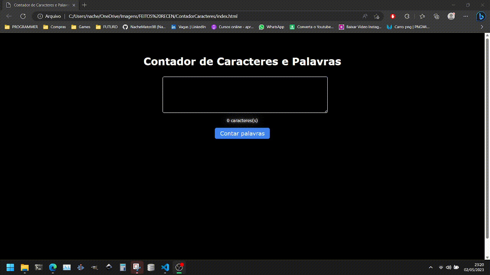

# Projeto - Contador de Caracteres e Palavras

Uma simples aplicação feita para consultar a quantidade de palavras e caracteres, feito com JavaScript puro, HTML e CSS.

- O projeto
- Página assim que é aberta.

 

## 💻 Tecnologias utilizadas
As seguintes ferramentas foram utilizadas na construção do projeto:
- [Javascript](https://developer.mozilla.org/en-US/docs/Web/JavaScript) | [HTML](https://developer.mozilla.org/en-US/docs/Web/HTML) | [CSS](https://developer.mozilla.org/en-US/docs/Web/CSS)
